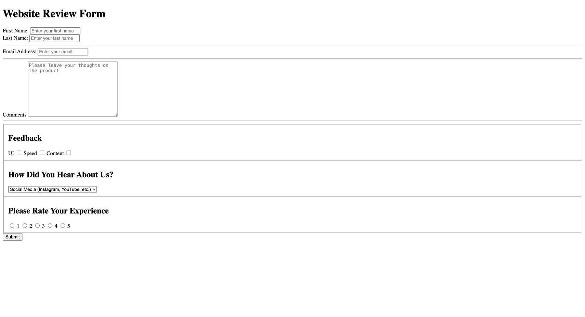

# Exercise 03 — Website Review Form

[Live demo](https://vigneshsrinivasan-sys.github.io/exercise-03-website-review-form/) · [HTML source](index.html)

## Why this exercise exists

This is an independent practice project completed while working through Colt Steele’s *The HTML & CSS Bootcamp*. The course provides the ordered learning content; I use each exercise to reinforce the concept until it is understood, then apply it in a concrete interface and push beyond the minimum lesson where appropriate. Together, these projects document a deliberate progression toward stronger design-to-code fluency as a Product Designer.

## Focus

**Primary practice:** Form structure, labels, and native controls

## What I built

The review flow brings together labels, required fields, email input, textarea, checkboxes, select controls, radio groups, fieldsets, and a submit action.

## Implementation notes

- The page is a static HTML/CSS build with the original exercise content and visual treatment preserved for inspection.
- The preview above is a rendered snapshot of the project; the live demo shows the page itself.
- The source is presented as a standalone project so the exercise can be opened, understood, and reviewed without navigating through a larger catalogue.

## Sequence

**Exercise 03** · Independent practice
